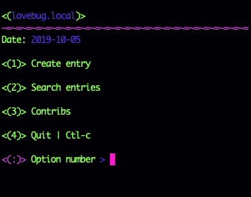

<p align="center">
  
</p>


# __py_memo__

### :exclamation: Currently under maintenance as of 10/04/19

## How to run:

```
python<version> engine.py <storage.csv>
```


The storage file must be a `.csv` file. and it must be inside the storage folder; that way you can have many storages.

### TO DO:
* Tests
    * Test components
    * Test torks

* Function to change storages from the menu.
* Functions to copy storages from other locations.
* Functions to back_up storages.


